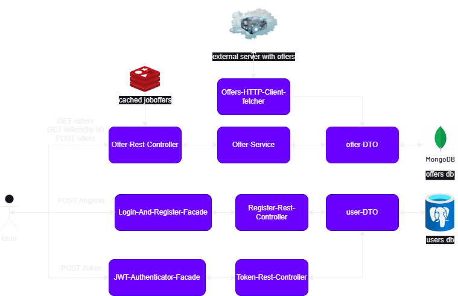

<h1 align="center">Job Offers Application
</h1>

# Job Offers Web Application

This project is a web application created in Spring Boot, allowing users to search for and add new job offers. The architecture of the project is designed using the Facade Architecture pattern.

## Features
- **Search Job Offers:** Users can search for job offers within the application.
- **Add New Job Offers:** Users can add new job offers to the system.

## Deployment
The application is deployed on AWS, and you can access the [Swagger UI](http://ec2-3-79-99-187.eu-central-1.compute.amazonaws.com:8000/swagger-ui/index.html#/github-rest-controller/getAllRepositories) to interact with its endpoints.
## Diagram

 
 

|       ENDPOINT        | METHOD  |         REQUEST          |       RESPONSE       |                    FUNCTION                     |
|:---------------------:|:-------:|:------------------------:|:--------------------:|:-----------------------------------------------:|
|        /offers        |  GET    |            -             |    JSON (offers)     |                returns all offers               |
|        /offers        |  POST   |    JSON BODY (offer)     |      JSON (uuid)     |                creates new offer                |
|     /offers/{uuid}    |  GET    |   PATH VARIABLE (uuid)   |     JSON (offer)     |          returns offer with given uuid          |
|         /token        |  POST   |  JSON BODY (credentials) |   JSON (JWT token)   | returns token after successfully authorization  |
|       /register       |  POST   |     JSON BODY (user)     |      JSON (id)       |                 creates new user                |

## Tech Stack
Code:  

 
Tests:  

 
 
Other:  

## Solved Problems
Throughout the development of this project, I encountered a variety of challenges. Here are a few of them.
<ul>
    <li>Code organization with independent modules - Facade architecture</li>
    <li>Implementing facades was a key aspect of the project.</li>
    <li>I ensured that my code was encapsulated, allowing me to hide implementation details and making it easier to use individual components.</li>
    <li>I implemented authorization using JWT tokens and security mechanisms provided by Spring Security, ensuring the security of my application.</li>
    <li>Integration tests using TestContainers</li>
    <li>Applying SOLID principles</li>
    <li>I deployed my application on AWS, utilizing EC2 for hosting and ECR for container storage.</li>
    <li>Effective use of GitHub was crucial for organized and efficient project development. I focused on proper branch usage, pull request management, and maintaining a clear commit history.</li>
</ul>
